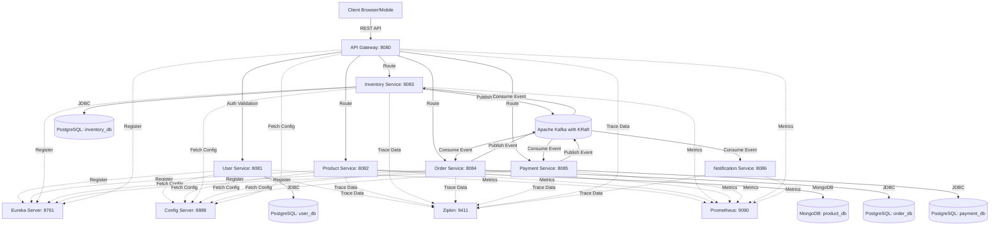
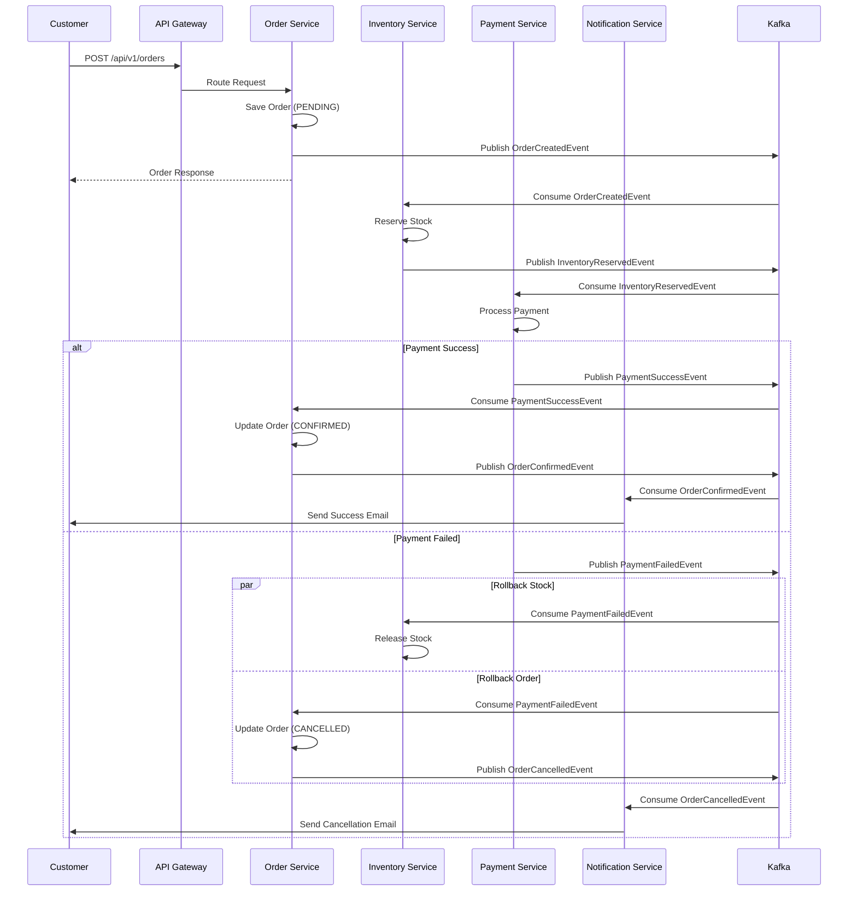

# Distributed Event-Driven E-Commerce Microservices Platform

A production-ready, highly scalable, event-driven e-commerce platform built using modern Java architecture (Spring Boot 3, Spring Cloud), event sourcing (Apache Kafka & Avro), distributed data management, and the Choreography Saga pattern.

## System Architecture



## Saga Pattern (Order Flow)

The platform implements the **Choreography Saga Pattern** to ensure eventual consistency:



## Tech Stack

- **Java**: 21 (LTS)
- **Framework**: Spring Boot 3.2.5, Spring Cloud 2023.0.1
- **Build Tool**: Apache Maven 3.9.6
- **Event Broker**: Apache Kafka (KRaft mode, no Zookeeper dependency)
- **Serialization**: Apache Avro + Confluent Schema Registry
- **Databases**: PostgreSQL 15 (Relational), MongoDB 6.0 (NoSQL)
- **Security**: JWT Validation Filter at API Gateway
- **Resilience**: Resilience4j Circuit Breakers
- **Observability**: Micrometer, Zipkin, Prometheus, Grafana
- **Containerization**: Docker, Docker Compose
- **Orchestration**: Kubernetes

## Modules

| Module | Port | Responsibility |
| --- | --- | --- |
| `eureka-server` | 8761 | Netflix Eureka Service Discovery |
| `config-server` | 8888 | Centralized Configuration Management |
| `api-gateway` | 8080 | Routing, Load Balancing, Global JWT Auth, Circuit Breakers |
| `user-service` | 8081 | JWT generation, User auth (PostgreSQL) |
| `product-service` | 8082 | Product Catalog, Caching (MongoDB) |
| `inventory-service` | 8083 | Stock management, Reservations (PostgreSQL) |
| `order-service` | 8084 | Saga Orchestrator, Order states (PostgreSQL) |
| `payment-service` | 8085 | Simulates payment gateway (PostgreSQL) |
| `notification-service` | 8086 | Simulates emails/SMS via Kafka topics |
| `common-dto` | — | Shared DTOs, Avro schemas, and event contracts |

## Installation & Running Locally

### Prerequisites

- **Java 21** (LTS)
- **Maven 3.9.6** (bundled in `./maven/apache-maven-3.9.6/`)

### Option 1: Local Infrastructure (Windows — No Docker Required)

The `infra/` directory contains pre-bundled binaries for PostgreSQL, MongoDB, and Confluent Kafka. No Docker installation is needed.

1. **Start Infrastructure**
   ```powershell
   .\infra\start_infra.ps1
   ```
   *This starts PostgreSQL (with databases: user_db, inventory_db, order_db, payment_db), MongoDB, ZooKeeper, Kafka, and Schema Registry.*

2. **Build All Modules**
   ```powershell
   .\maven\apache-maven-3.9.6\bin\mvn.cmd clean install -DskipTests
   ```

3. **Start All Microservices**
   ```powershell
   .\start-all.ps1
   ```
   *Launches services in order: Eureka → Config Server → API Gateway → Business Services*

4. **Stop All Services**
   ```powershell
   .\stop-all.ps1
   ```

### Option 2: Docker Compose

1. **Start the Infrastructure Components**
   ```bash
   docker-compose up -d
   ```
   *This starts PostgreSQL, MongoDB, Kafka, Schema Registry, Zipkin, Prometheus, and Grafana.*

2. **Build All Modules**
   ```bash
   mvn clean install -DskipTests
   ```
   *Note: `common-dto` must be compiled first so Avro schemas generate Java POJOs.*

3. **Run Services** (via IntelliJ/Eclipse or `java -jar`)
   *Start order: `eureka-server` → `config-server` → `api-gateway` → business microservices*

## Verified Running Status

All 8 services register successfully with Eureka and report **UP** status:

| Service | Port | Status |
|---------|------|--------|
| Eureka Server | 8761 | ✅ UP |
| Config Server | 8888 | ✅ UP |
| API Gateway | 8080 | ✅ UP |
| User Service | 8081 | ✅ UP |
| Product Service | 8082 | ✅ UP |
| Inventory Service | 8083 | ✅ UP |
| Order Service | 8084 | ✅ UP |
| Payment Service | 8085 | ✅ UP |
| Notification Service | 8086 | ✅ UP |

## Swagger / API Docs

- User Service: `http://localhost:8081/swagger-ui.html`
- Product Service: `http://localhost:8082/swagger-ui.html`
- Inventory Service: `http://localhost:8083/swagger-ui.html`
- Order Service: `http://localhost:8084/swagger-ui.html`
- Payment Service: `http://localhost:8085/swagger-ui.html`

## Monitoring & Observability

- **Eureka Dashboard**: `http://localhost:8761`
- **Zipkin (Tracing)**: `http://localhost:9411`
- **Prometheus**: `http://localhost:9090`
- **Grafana**: `http://localhost:3000` (admin/admin)

## Kubernetes Commands

Apply the cluster manifest:
```bash
kubectl apply -f k8s/ecommerce-deployment.yaml
```
Verify pods are running:
```bash
kubectl get pods
```

---

*Architected and developed using best practices including Clean Architecture, SOLID principles, CQRS conceptualization for reads, and comprehensive Global Exception Handling.*
