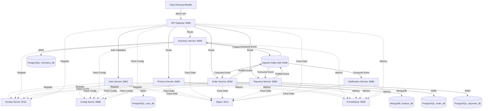
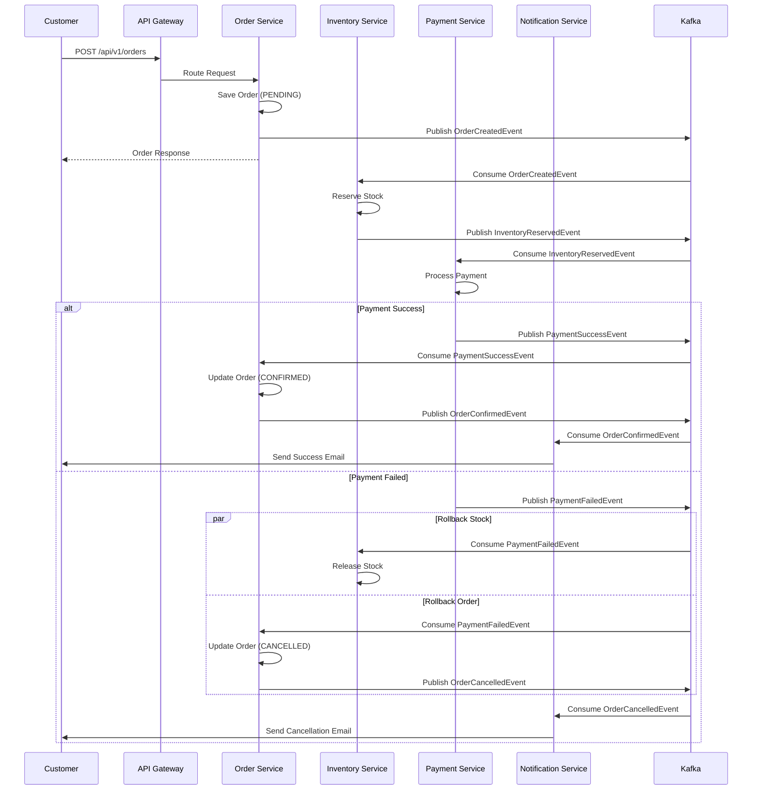

# Distributed Event-Driven E-Commerce Microservices Platform

A production-ready, highly scalable, event-driven e-commerce platform built using modern Java architecture (Spring Boot 3, Spring Cloud), event sourcing (Apache Kafka & Avro), distributed data management, and the Choreography Saga pattern.

## System Architecture



## Saga Pattern (Order Flow)

The platform implements the **Choreography Saga Pattern** to ensure eventual consistency:



## Tech Stack

- **Java**: 21 (LTS)
- **Framework**: Spring Boot 3.2.5, Spring Cloud 2023.0.1
- **Build Tool**: Apache Maven 3.9.6
- **Event Broker**: Apache Kafka (KRaft mode, no Zookeeper dependency)
- **Serialization**: Apache Avro + Confluent Schema Registry
- **Databases**: PostgreSQL 15 (Relational), MongoDB 6.0 (NoSQL)
- **Security**: JWT Validation Filter at API Gateway
- **Resilience**: Resilience4j Circuit Breakers
- **Observability**: Micrometer, Zipkin, Prometheus, Grafana
- **Containerization**: Docker, Docker Compose
- **Orchestration**: Kubernetes

## Modules

| Module | Port | Responsibility |
| --- | --- | --- |
| `eureka-server` | 8761 | Netflix Eureka Service Discovery |
| `config-server` | 8888 | Centralized Configuration Management |
| `api-gateway` | 8080 | Routing, Load Balancing, Global JWT Auth, Circuit Breakers |
| `user-service` | 8081 | JWT generation, User auth (PostgreSQL) |
| `product-service` | 8082 | Product Catalog, Caching (MongoDB) |
| `inventory-service` | 8083 | Stock management, Reservations (PostgreSQL) |
| `order-service` | 8084 | Saga Orchestrator, Order states (PostgreSQL) |
| `payment-service` | 8085 | Simulates payment gateway (PostgreSQL) |
| `notification-service` | 8086 | Simulates emails/SMS via Kafka topics |
| `common-dto` | — | Shared DTOs, Avro schemas, and event contracts |

## Installation & Running Locally

### Prerequisites

- **Java 21** (LTS)
- **Maven 3.9.6** (bundled in `./maven/apache-maven-3.9.6/`)

### Option 1: Local Infrastructure (Windows — No Docker Required)

The `infra/` directory contains pre-bundled binaries for PostgreSQL, MongoDB, and Confluent Kafka. No Docker installation is needed.

1. **Start Infrastructure**
   ```powershell
   .\infra\start_infra.ps1
   ```
   *This starts PostgreSQL (with databases: user_db, inventory_db, order_db, payment_db), MongoDB, ZooKeeper, Kafka, and Schema Registry.*

2. **Build All Modules**
   ```powershell
   .\maven\apache-maven-3.9.6\bin\mvn.cmd clean install -DskipTests
   ```

3. **Start All Microservices**
   ```powershell
   .\start-all.ps1
   ```
   *Launches services in order: Eureka → Config Server → API Gateway → Business Services*

4. **Stop All Services**
   ```powershell
   .\stop-all.ps1
   ```

### Option 2: Docker Compose

1. **Start the Infrastructure Components**
   ```bash
   docker-compose up -d
   ```
   *This starts PostgreSQL, MongoDB, Kafka, Schema Registry, Zipkin, Prometheus, and Grafana.*

2. **Build All Modules**
   ```bash
   mvn clean install -DskipTests
   ```
   *Note: `common-dto` must be compiled first so Avro schemas generate Java POJOs.*

3. **Run Services** (via IntelliJ/Eclipse or `java -jar`)
   *Start order: `eureka-server` → `config-server` → `api-gateway` → business microservices*

## Verified Running Status

All 8 services register successfully with Eureka and report **UP** status:

| Service | Port | Status |
|---------|------|--------|
| Eureka Server | 8761 | ✅ UP |
| Config Server | 8888 | ✅ UP |
| API Gateway | 8080 | ✅ UP |
| User Service | 8081 | ✅ UP |
| Product Service | 8082 | ✅ UP |
| Inventory Service | 8083 | ✅ UP |
| Order Service | 8084 | ✅ UP |
| Payment Service | 8085 | ✅ UP |
| Notification Service | 8086 | ✅ UP |

## Swagger / API Docs

- User Service: `http://localhost:8081/swagger-ui.html`
- Product Service: `http://localhost:8082/swagger-ui.html`
- Inventory Service: `http://localhost:8083/swagger-ui.html`
- Order Service: `http://localhost:8084/swagger-ui.html`
- Payment Service: `http://localhost:8085/swagger-ui.html`

## Monitoring & Observability

- **Eureka Dashboard**: `http://localhost:8761`
- **Zipkin (Tracing)**: `http://localhost:9411`
- **Prometheus**: `http://localhost:9090`
- **Grafana**: `http://localhost:3000` (admin/admin)

## Health Check

Verify all services are running:
```powershell
.\health-check.ps1
```
For detailed output:
```powershell
.\health-check.ps1 -Verbose
```

## Interactive Web Dashboard

A modern web-based monitoring and orchestration dashboard is included in the `dashboard/` directory.

### Features:
- **Orchestrate Services**: Spin up and shutdown the microservices infrastructure directly from the UI.
- **Service Monitor**: Live health-status updates (UP/DOWN/TIMEOUT) for Eureka, Config Server, Gateway, and all business microservices.
- **User Authentication**: Register/Login as a `CUSTOMER` or `ADMIN`.
- **Catalogue & Inventory management**: Add new products and initialize stock levels (Requires `ADMIN` authentication).
- **Interactive Saga Checkout**: Add items to your checkout cart, place orders, and visualize the **Saga Choreography Workflow** in real-time.

### Running the Dashboard:
1. Navigate to the dashboard directory:
   ```bash
   cd dashboard
   ```
2. Install dependencies:
   ```bash
   npm install
   ```
3. Start the dashboard server:
   ```bash
   npm start
   ```
4. Access the application in your browser: `http://localhost:3000`

## End-to-End (E2E) API Verification

To verify that the complete platform (API Gateway, Identity Service, Product Catalogue, Inventory Stocking, Order Placement, and Saga Event Broker Flow) is working correctly, you can run the automated test script:

```powershell
.\test_platform.ps1
```

This PowerShell script automates:
1. Registering and logging in a new Customer to acquire a valid JWT.
2. Registering and logging in an Admin user to gain catalogue modification privileges.
3. Creating a new product category and product item through the API Gateway.
4. Setting stock levels for the product in the Inventory database.
5. Placing a new purchase order as the customer.
6. Polling and printing the SAGA status transitions (`PENDING` -> `CONFIRMED` or `CANCELLED`).

## Kubernetes Deployment

All 9 microservices have production-ready K8s manifests with:
- **Resource requests/limits** (CPU & memory)
- **Liveness & readiness probes** (actuator health endpoints)
- **ConfigMap-based** environment injection
- **Labels** for `app.kubernetes.io/part-of` grouping

Apply the cluster manifests:
```bash
kubectl apply -f k8s/ecommerce-deployment.yaml
```
Verify pods are running:
```bash
kubectl get pods
kubectl get services
```

## Contributing

See [CONTRIBUTING.md](CONTRIBUTING.md) for development guidelines, code standards, and PR process.

---

*Architected and developed using best practices including Clean Architecture, SOLID principles, CQRS conceptualization for reads, and comprehensive Global Exception Handling.*
